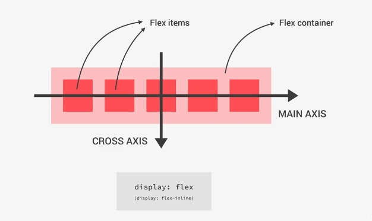
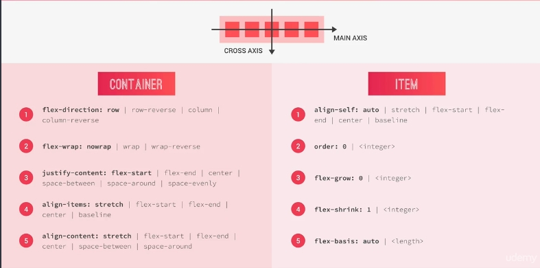

[✔]: ../../../../assets/images/checkbox-small-blue.png

# CSS - Cascading Style Sheet

<br /><br />

<br /><br />

## Table of contents

1. [CSS Layout](#1-css-layout)
2. [Responsive Design & Media Queries](#2-responsive-design-media-queries)
3. [CSS code modules](#3-css-code-modules)

<br /><br />

# `1. CSS Layout`

🔗 [**Read More: CSS layout**](https://css-tricks.com/guides/layout)

## ![✔] 1.1 Flexbox

### What is flexbox?

- it makes easy to align elements to one another, in different direction
- replaces float layouts, using less and more readable and logical code
- uses in one directional layouts

### Main flexbox concepts

<figure>
  
  <figcaption>Flexbox Structure</figcaption>
</figure>

<br /><br />

<figure>
  
  <figcaption>Flexbox Cheatsheet</figcaption>
</figure>

<br /><br />

```
flex-direction: row; // main-axis - horizontal, cross-axis - vertical
flex-direction: column; // main-axis - vertical, cross-axis - horizontal

justify-content - define main axis
align-content - define cross axis
```

🔗 [**Read More: Flexbox**](sections/flexbox)

# `2. Responsive Design & Media Queries`

# `3. CSS code modules`

- [my code modules](https://gist.github.com/foyez/c979ab5c45a9fc6cbd9f8cf76439a699)
